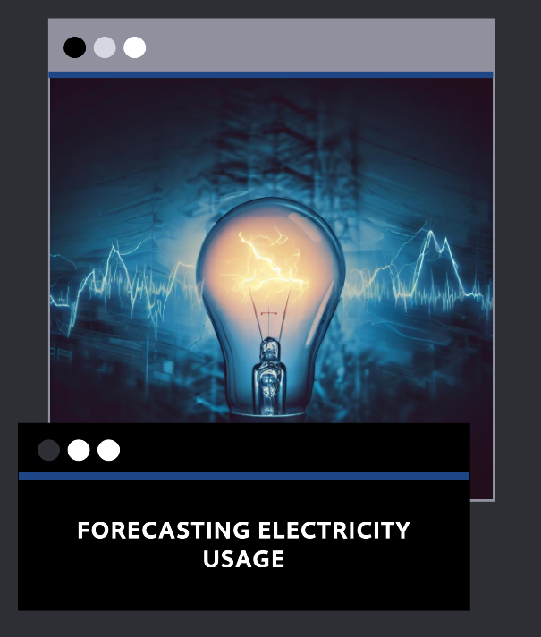

# Electricity_Time_Series_ARIMA
This project is about implementing the ARIMA (Autoregressive Integrated Moving Average) time series model to predict electricity consumption. The dataset used in this project is sourced from Kaggle [1], which contains monthly electricity production data in the United States from January 1985 to December 2018.

The implementation of the ARIMA model was guided by a notebook [2] and performed using Python programming language with libraries such as pandas, numpy, matplotlib, and statsmodels.

The project starts with data preprocessing, where the data is read from the CSV file and checked for stationarity. Stationarity is checked by plotting the rolling mean and standard deviation of the data, and if needed, the first difference of the data is taken to make it stationary.

Next, the optimal values of p, d, and q are determined. The p represents the number of lagged values to include, q represents the number of lagged forecast errors to include in the MA (moving average) part of the model, and d represents the degrees of differencing needed to make the data stationary. The values of p and q are determined by plotting the ACF (Autocorrelation Function) and PACF (Partial Autocorrelation Function) plots, while d is determined by the number of times we need to difference the data to make it stationary.

After determining the optimal values of p, d, and q, the ARIMA model is trained on the entire dataset, and the model's forecast is generated. The performance of the model is evaluated by calculating metrics such as mean squared error (MSE), root mean squared error (RMSE), and mean absolute error (MAE).

In addition, a function is defined to train a seasonally adjusted ARIMA (SARIMA) model, which considers seasonal patterns in the data. This function also calculates the performance metrics and generates the model's forecast.

Overall, this project demonstrates how to implement the ARIMA and SARIMA models to forecast time series data and provides a good starting point for further exploration and experimentation with time series modeling.

[1] https://www.kaggle.com/code/nageshsingh/predict-electricity-consumption/input
